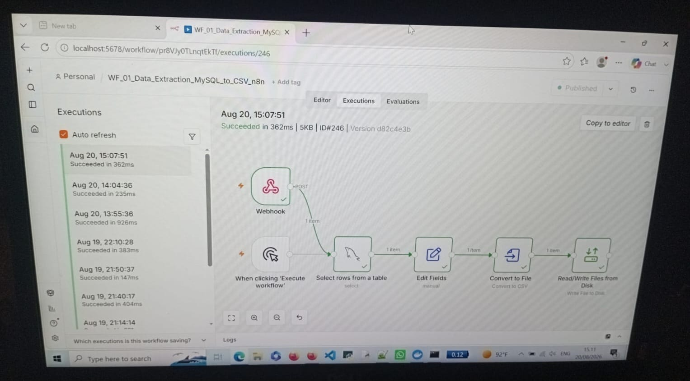
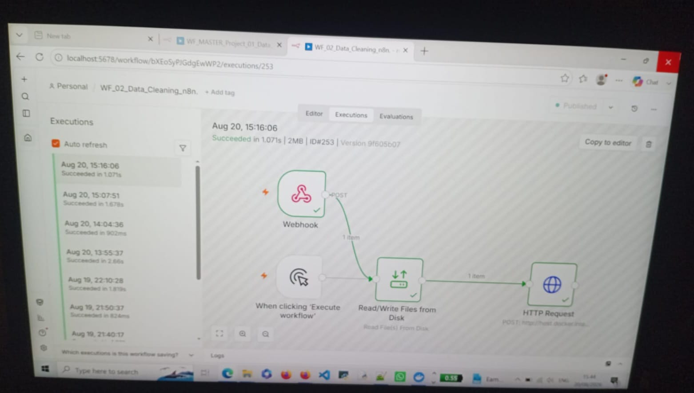
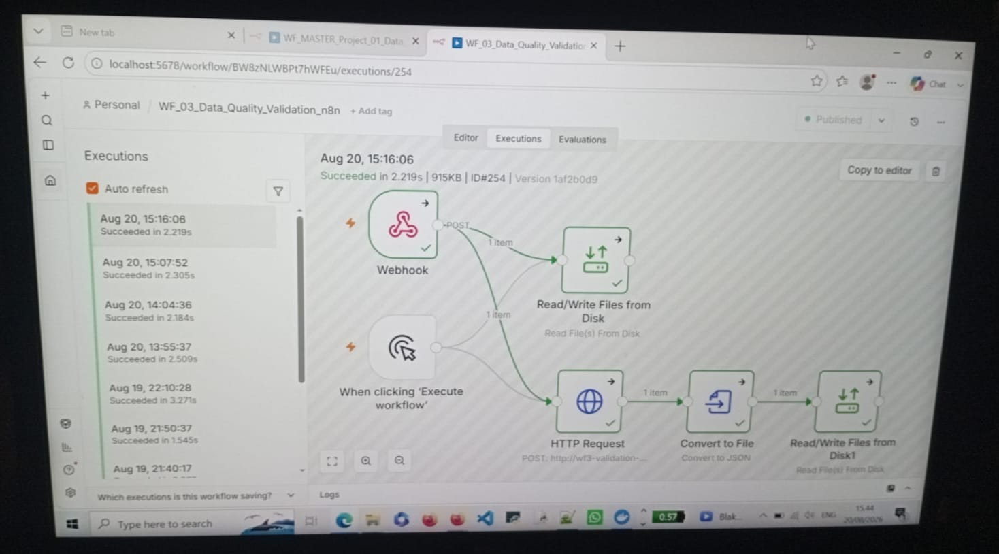
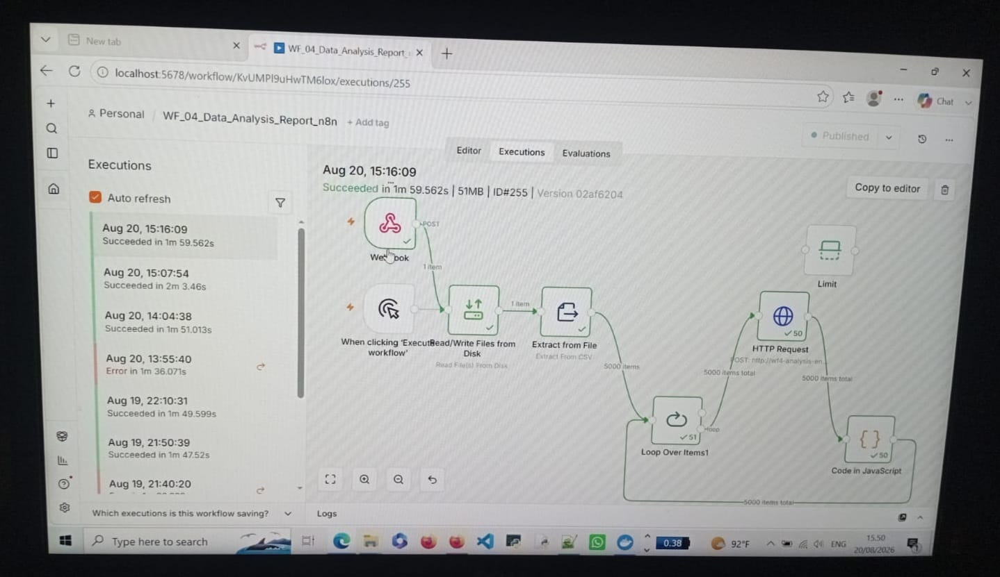
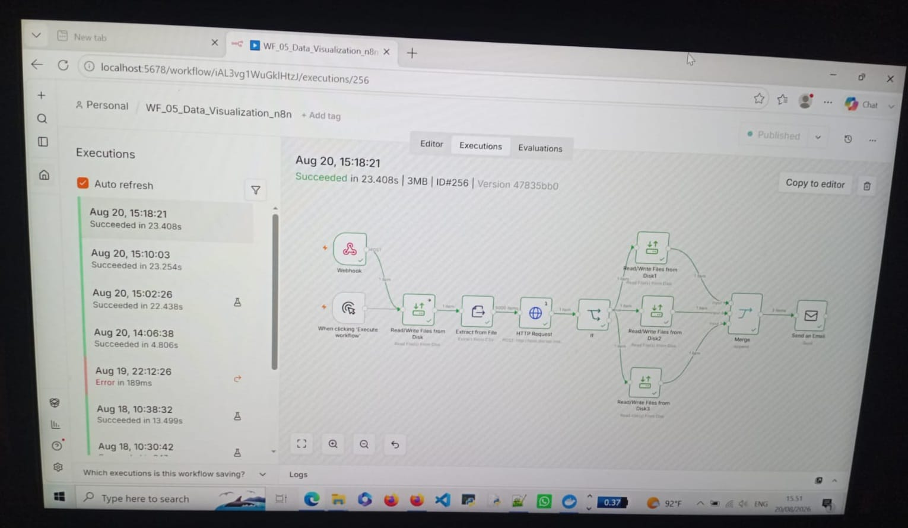
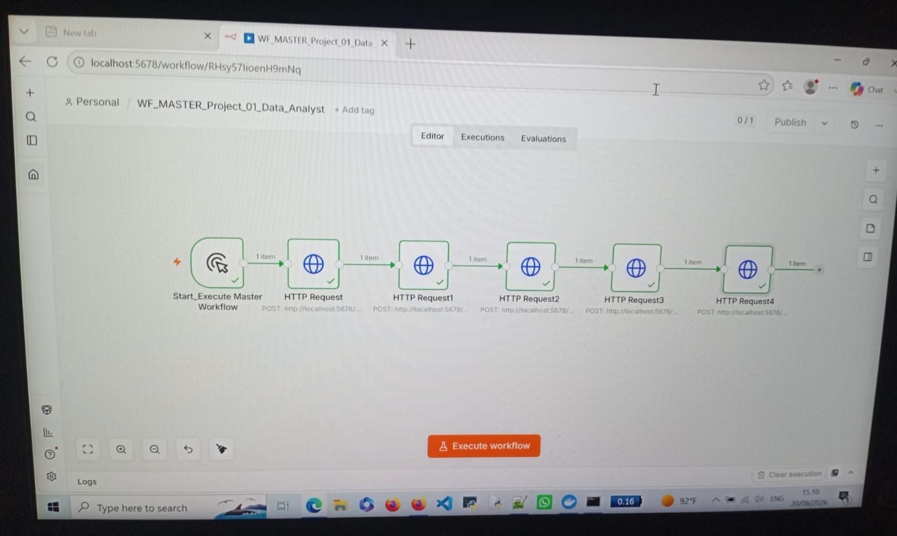
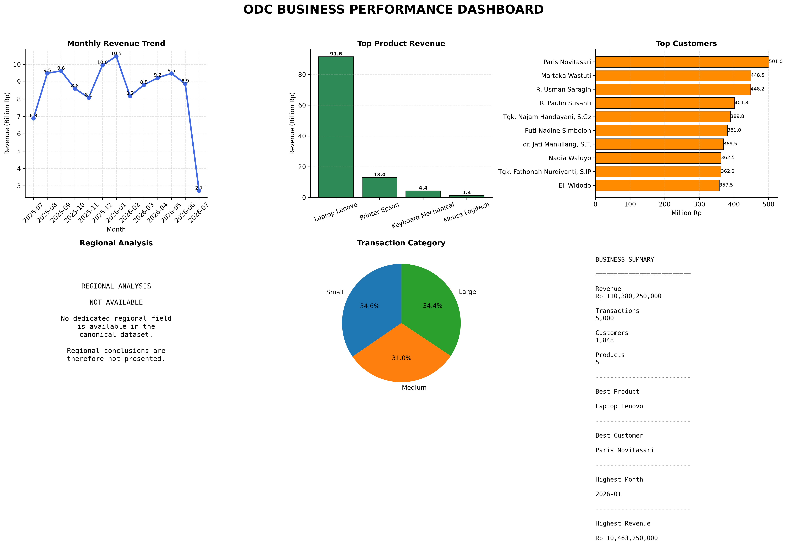

# DATA ANALYTICS PORTFOLIO

## Project 01 — ODC Bag 8

### From Raw Data to Trusted Business Insight

**Data Analyst | Python • SQL • MySQL • Pandas • n8n • Docker • Matplotlib**

---

## Executive Summary

This project demonstrates an end-to-end **data analytics and analytical control workflow**, from raw transactional data to validated business insights and automated reporting.

The project was designed around a simple principle:

> **Do not trust a number simply because a system produced it. Validate it.**

The analytical process connects:

**Data Extraction → Data Cleaning → Data Quality Validation → Analysis → Reconciliation → Root-Cause Investigation → Visualization → Audit → Automated Reporting**

The objective was not only to produce analytical results, but to make those results:

* **Accurate**
* **Traceable**
* **Reproducible**
* **Explainable**
* **Auditable**
* **Business-oriented**

---

# 1. BUSINESS CHALLENGE

Real-world analytical environments can contain differences between systems, workflows, and analytical outputs.

A number may look correct while being based on:

* a different data population;
* a different output file;
* a different data grain;
* a different analytical method;
* or a legacy artifact.

This project therefore focused on a deeper question:

> **Can the analytical result be trusted, and can it be proven?**

The project was built to demonstrate how an analyst can move beyond calculation and investigate the **data, process, lineage, reconciliation, and evidence behind the number**.

---

# 2. DATA & PROJECT SCOPE

### Initial Dataset

| Item                             |     Value |
| -------------------------------- | --------: |
| Initial Records                  | **5,000** |
| Columns                          |    **14** |
| Duplicate Records                |     **0** |
| Missing Address Values           |   **255** |
| Validated Transaction Population | **5,000** |

The dataset covers transactional and business information related to:

* Transactions
* Customers
* Products
* Sales
* Financial analysis

### Main Analytical Areas

The project covers:

**Sales · Product · Customer · Region · Transaction · Finance · Visualization · Automation**

---

# 3. TECHNOLOGY STACK

| Technology     | Purpose                                            |
| -------------- | -------------------------------------------------- |
| **MySQL**      | Structured transactional data storage              |
| **SQL**        | Data querying and aggregation                      |
| **Python**     | Cleaning, validation, reconciliation, and analysis |
| **Pandas**     | Data transformation and analytical processing      |
| **Matplotlib** | Business visualization                             |
| **n8n**        | Workflow automation and orchestration              |
| **Docker**     | Containerized services and environment isolation   |
| **CSV**        | Data exchange and analytical outputs               |

The strength of the project is not simply the number of tools used.

It is the ability to connect those tools into one controlled analytical system.

---

# 4. TECHNICAL ARCHITECTURE

The project follows a controlled workflow:

```text
MySQL
   ↓
WF1 — Data Extraction
   ↓
WF2 — Data Cleaning
   ↓
WF3 — Data Quality Validation
   ↓
WF4 — Data Analysis
   ↓
WF5 — Data Visualization
   ↓
WF_MASTER — End-to-End Orchestration
```

The architecture separates responsibilities between workflow stages while maintaining traceability across the analytical process.

---

# 5. WORKFLOW OVERVIEW

## WF1 — Data Extraction

Extracts source data from MySQL into the analytical workflow.

**Status: COMPLETE**

---

## WF2 — Data Cleaning

Processes the extracted dataset and handles data-quality issues identified during preparation.

The initial dataset contained:

* **5,000 records**
* **255 missing address values**
* **0 duplicate records**

**Status: COMPLETE**

---

## WF3 — Data Quality Validation

Validates the resulting dataset before analytical processing continues.

**Status: PASS**

The workflow was subsequently frozen after validation.

---

## WF4 — Data Analysis

Transforms validated data into structured analytical outputs covering business, customer, transaction, product, and financial perspectives.

**Status: PASS**

---

## WF5 — Data Visualization

Transforms validated analytical results into business-oriented charts, dashboard outputs, and reporting content.

**Status: PASS**

---

## WF_MASTER — Orchestration

Coordinates:

**WF1 → WF2 → WF3 → WF4 → WF5**

The master workflow provides a controlled execution path from source data to analytical reporting.

**Status: FINAL CONTROL**

---

# 6. VALIDATED KEY RESULTS

## Transaction Performance

The final validated transaction population established:

| KPI              |      Validated Result |
| ---------------- | --------------------: |
| **Transactions** |             **5,000** |
| **Units**        |            **27,400** |
| **Revenue**      | **Rp110,380,250,000** |

### Validated Revenue

# **Rp110,380,250,000**

This value is supported through the project's reconciliation and audit process.

---

# 7. CUSTOMER ANALYSIS

The validated customer population contains:

# **1,848 Customers**

Customer segmentation identified:

| Segment   | Customers |      Share |
| --------- | --------: | ---------: |
| Active    |   **691** | **37.39%** |
| At-Risk   |   **734** | **39.72%** |
| Inactive  |   **423** | **22.89%** |
| **Total** | **1,848** |   **100%** |

### Key Business Finding

The **At-Risk** segment is the largest customer group:

# **734 customers — 39.72%**

This indicates a clear customer-retention priority.

From a business perspective, the finding can support:

* targeted retention campaigns;
* customer reactivation;
* follow-up strategies;
* prioritization of high-risk customer groups.

The analytical value is not simply identifying the segment.

It is translating the segment into a **business action opportunity**.

---

# 8. THE CRITICAL RECONCILIATION

One of the most important findings in this project was a historical revenue discrepancy.

Two states were identified:

| Data State                           |   Records |               Revenue |
| ------------------------------------ | --------: | --------------------: |
| **Validated Transaction Population** | **5,000** | **Rp110,380,250,000** |
| **Historical n8n Artifact**          | **4,745** | **Rp104,902,500,000** |
| **Difference**                       |   **255** |   **Rp5,477,750,000** |

The investigation established that:

* the validated transaction population contains **5,000 transactions**;
* the historical artifact contained **4,745 records**;
* the revenue difference was **Rp5,477,750,000**;
* the 255-record population difference corresponds exactly to the revenue difference;
* the current Cleaning API was subsequently verified to receive and produce **5,000 transactions**;
* no evidence established that the current Financial Layer directly deleted transactions.

### What the Investigation Did Not Prove

The exact historical mechanism that produced the 4,745-row artifact could **not be conclusively established from the available source-code evidence**.

Therefore, the investigation does **not** claim a mechanism that the evidence cannot prove.

This distinction is important.

> **The evidence confirmed the discrepancy, but it did not prove exactly how the historical 255 records were removed.**

The investigation stopped where the evidence stopped.

That is a fundamental analytical and audit principle.

---

# 9. ROOT-CAUSE CLASSIFICATION

The confirmed architectural issue was classified as:

## **Data Lineage / Output Management Inconsistency**

Multiple output paths and filenames were identified for the same logical cleaned dataset.

This increased the risk that downstream processes could reference:

* a legacy artifact;
* a non-canonical output;
* or a different physical representation of the same logical dataset.

The independent **Financial Data Source and Grain Alignment** investigation also identified differences between transaction-level financial calculation and downstream aggregated analytical sources.

Therefore, the investigation distinguished between:

**Confirmed evidence**

and

**Mechanisms that could not be conclusively proven.**

This makes the finding defensible rather than speculative.

---

# 10. RECONCILIATION AS A CONTROL

Reconciliation was used as a **control mechanism throughout the project**, not simply as a final comparison.

The analysis covered:

* Sales
* Product
* Customer
* Transaction
* Financial

Three control paths were used:

```text
Manual Python ↔ Master

Manual Python ↔ n8n

Master ↔ n8n
```

### What Reconciliation Was Designed to Answer

The purpose was not to force different systems to produce identical numbers.

It was to determine:

1. **Should the results agree?**
2. **Do they actually agree?**
3. **If they differ, what caused the difference?**
4. **Which result is supported by the correct and validated data population?**

This allowed the project to distinguish between:

**True data inconsistencies**

and

**Valid differences caused by analytical logic, data grain, or source population.**

> **Reconciliation does not make numbers agree. It proves whether they should agree — and explains why when they do not.**

---

# 11. AUDIT & EVIDENCE

The project underwent a formal final audit covering:

**DATABASE · SALES · PRODUCT · CUSTOMER · REGION · TRANSACTION · FINANCE · GENERATOR · DASHBOARD**

### Final Workflow Audit

| Workflow                          | Final Status  |
| --------------------------------- | ------------- |
| **WF1 — Extraction**              | COMPLETE      |
| **WF2 — Cleaning**                | COMPLETE      |
| **WF3 — Data Quality Validation** | PASS          |
| **WF4 — Data Analysis**           | PASS          |
| **WF5 — Visualization**           | PASS          |
| **WF_MASTER — Orchestration**     | FINAL CONTROL |

### What the Audit Confirmed

The final audit established that:

* core workflows were completed;
* validation controls were passed;
* analytical outputs were reconciled;
* identified discrepancies were investigated;
* root-cause findings were documented;
* final outputs were supported by traceable evidence.

The controlled chain is:

```text
Data
  ↓
Workflow
  ↓
Analysis
  ↓
Reconciliation
  ↓
Investigation
  ↓
Audit Evidence
```

## Final Audit Status

# **COMPLETE**

The project was not considered complete merely because the workflows executed successfully.

Completion was established after the outputs had been:

**Validated → Reconciled → Investigated → Documented → Supported by Evidence**

---

# 12. VISUALIZATION & REPORTING

WF5 transformed validated analytical results into business-oriented outputs.

Generated outputs include:

* Analytical charts
* Business dashboard
* PDF reporting
* Automated reporting content

Visualization was treated as the **communication layer** of the analytical process.

The objective was to make validated results:

**Easier to understand.
Easier to compare.
Easier to act upon.**

> **A visualization becomes valuable when it helps decision-makers understand what happened, why it matters, and where action may be needed.**

---

# 13. AUTOMATION

The project evolved from individual workflow stages into an **end-to-end automated orchestration model**.

### WF_MASTER

```text
WF1
 ↓
WF2
 ↓
WF3
 ↓
WF4
 ↓
WF5
```

Automation provides:

* **Repeatability** — the process can be executed consistently.
* **Consistency** — each stage follows a defined workflow.
* **Reduced manual intervention** — fewer repetitive handoffs.
* **Clear workflow boundaries** — each stage has a defined responsibility.
* **Traceability** — outputs can be followed across the workflow.

The technical achievement is not simply using n8n.

It is designing an automated analytical process in which individual stages can be **connected, executed, validated, and traced as one controlled system**.

> **The value of automation is not simply doing the work faster. It is making the process repeatable, controlled, and traceable.**

---

# 14. TECHNICAL CAPABILITY

### SQL / MySQL

Database querying, transactional data handling, aggregation, and structured analytical data preparation.

### Python

Data cleaning, validation, reconciliation, analysis, and analytical control.

### Pandas

Data transformation, aggregation, matching, and structured analytical processing.

### Matplotlib

Business-oriented charts and analytical visualization.

### n8n

Workflow orchestration, system integration, automated processing, and end-to-end execution.

### Docker

Containerized execution environments, service isolation, and multi-service architecture.

### Analytical Engineering

Connecting databases, Python services, validation processes, analytical workflows, and reporting into **one repeatable and traceable system**.

### What This Demonstrates

The technical value is not simply familiarity with individual tools.

It is the ability to combine them into a working analytical system where data can move from source to validated business output through a controlled process.

---

# 15. WHAT THIS PROJECT DEMONSTRATES

This project connects three important dimensions of analytical work.

## BUSINESS

Turning analytical findings into business questions and priorities.

Examples:

* **Customer risk →** retention priority
* **Revenue discrepancy →** financial reliability
* **Transaction population →** reporting accuracy
* **Visualization →** clearer decision communication

## ANALYTICAL

The ability to:

* validate assumptions;
* reconcile independent results;
* investigate discrepancies;
* trace root causes;
* build evidence;
* distinguish symptoms from causes;
* avoid conclusions that are not supported by evidence.

## TECHNICAL

The ability to:

* query and work with MySQL data;
* process data with Python and Pandas;
* build structured analytical workflows;
* automate processing with n8n;
* run services in Docker;
* produce analytical visualizations and reports.

### The Connection

```text
Technical Execution
        ↓
Reliable Data & Outputs
        ↓
Analytical Reasoning
        ↓
Validated Evidence
        ↓
Business Meaning
        ↓
Decision Support
```

> **Technical execution produces data. Analytical thinking turns data into evidence. Business thinking turns evidence into value.**

---

# 16. KEY ACHIEVEMENTS

## 01 — Established the Validated Revenue

# **Rp110,380,250,000**

Established from the final validated transaction population and supported by reconciliation and audit evidence.

---

## 02 — Investigated a Rp5,477,750,000 Revenue Difference

The project identified and investigated the difference between:

**Validated Revenue:** Rp110,380,250,000

**Legacy n8n Revenue:** Rp104,902,500,000

The investigation traced the difference to a historical:

**4,745-record artifact**

versus the validated:

**5,000-transaction population**

while clearly separating confirmed evidence from mechanisms that could not be conclusively proven.

---

## 03 — Validated 5,000 Transactions

Established and reconciled the final transaction population:

# **5,000 Transactions · 27,400 Units · Rp110,380,250,000 Revenue**

---

## 04 — Identified Customer Retention Risk

# **734 Customers / 39.72%**

were classified as **At-Risk Customers** within the validated population of:

# **1,848 Customers**

As the largest customer segment, this finding identifies customer retention as a clear business priority for targeted follow-up and reactivation strategies.

---

## 05 — Built a Controlled End-to-End Workflow

Completed and orchestrated:

# **WF1 → WF2 → WF3 → WF4 → WF5**

through **WF_MASTER**.

---

## 06 — Established Auditability

Key analytical results were supported through:

**Reconciliation → Investigation → Evidence → Final Audit**

This created a traceable connection between the underlying data, analytical results, and final business conclusions.

---

# 17. FINAL PROJECT OUTCOME

The project delivered more than automated analysis.

It established a workflow in which data could be:

**Processed → Validated → Reconciled → Investigated → Explained → Audited**

The result is not simply a collection of numbers.

It is a set of analytical results with evidence behind them.

---

# 18. EVIDENCE & TRACEABILITY

The detailed evidence is available inside this repository.

## Project & Architecture

* [Business Analysis Case Study & Requirements](docs/01_project/Business_Analysis_Case_Study_Requirements_EN.md)
* [Project Folder Structure](docs/01_project/Project_Folder_Structure_v2_EN.md)
* [Technical Troubleshooting](docs/01_project/Technical_Troubleshooting_Project_EN.md)
* [Database Schema](docs/02_architecture/Database_Schema_Perusahaan_db_EN.md)
* [Docker Project Architecture](docs/02_architecture/Docker_Project_Architecture_EN.md)
* [n8n Automation Architecture](docs/02_architecture/n8n_Automation_Architecture_and_Workflow_Design_EN.md)
* [n8n MySQL Connection](docs/02_architecture/n8n_MySQL_Connection_EN.md)

## Workflow Evidence

* [WF1 — Data Extraction](docs/03_workflows/WF_01_Final_Audit_Evidence_EN.md)
* [WF2 — Data Cleaning](docs/03_workflows/WF_02_Final_Audit_Evidence_EN.md)
* [WF3 — Data Quality Validation](docs/03_workflows/WF_03_Final_Audit_Evidence_EN.md)
* [WF4 — Data Analysis](docs/03_workflows/WF_04_Final_Audit_Evidence_EN.md)
* [WF5 — Data Visualization](docs/03_workflows/WF_05_Final_Audit_Evidence_EN.md)
* [WF_MASTER — Final Audit Evidence](docs/03_workflows/WF_Master_Final_Audit_Evidence_EN.md)
* [WF5 Final Email Report](docs/03_workflows/WF_05_Data_Visualization_Email_Final_Report_20260817_EN.md)

## Analytical Evidence

* [Customer Master vs Manual Python Reconciliation](docs/04_analysis/Customer_Master_vs_ManualPython_Reconciliation.md)
* [Product Analysis Reconciliation Update](docs/04_analysis/Product_Analysis_Reconciliation_Update_23_July_2026.md)

## Manual Python ↔ Master

* [Sales Reconciliation](evidence/reconciliation/python_vs_master/01_Sales_Reconciliation_ManualPython_vs_Master_EN.md)
* [Product Reconciliation](evidence/reconciliation/python_vs_master/02_Product_Reconciliation_ManualPython_vs_Master_EN.md)
* [Customer Reconciliation](evidence/reconciliation/python_vs_master/03_Customer_Reconciliation_ManualPython_vs_Master_EN.md)
* [Transaction Reconciliation](evidence/reconciliation/python_vs_master/04_Transaction_Reconciliation_ManualPython_vs_Master_EN.md)
* [Financial Reconciliation](evidence/reconciliation/python_vs_master/05_Financial_Reconciliation_ManualPython_vs_Master_EN.md)

## Manual Python ↔ n8n

* [Sales Reconciliation](evidence/reconciliation/python_vs_n8n/01_Sales_Reconciliation_ManualPython_vs_n8n_EN.md)
* [Product Reconciliation](evidence/reconciliation/python_vs_n8n/02_Product_Reconciliation_ManualPython_vs_n8n_EN.md)
* [Customer Reconciliation](evidence/reconciliation/python_vs_n8n/03_Customer_Reconciliation_ManualPython_vs_n8n_EN.md)
* [Transaction Reconciliation](evidence/reconciliation/python_vs_n8n/04_Transaction_Reconciliation_ManualPython_vs_n8n_EN.md)
* [Financial Reconciliation](evidence/reconciliation/python_vs_n8n/05_Financial_Reconciliation_ManualPython_vs_n8n_EN.md)

## Master ↔ n8n

* [Sales Reconciliation](evidence/reconciliation/master_vs_n8n/01_Sales_Reconciliation_Master_vs_n8n_EN.md)
* [Product Reconciliation](evidence/reconciliation/master_vs_n8n/02_Product_Reconciliation_Master_vs_n8n_EN.md)
* [Customer Reconciliation](evidence/reconciliation/master_vs_n8n/03_Customer_Reconciliation_Master_vs_n8n_EN.md)
* [Transaction Reconciliation](evidence/reconciliation/master_vs_n8n/04_Transaction_Reconciliation_Master_vs_n8n_EN.md)
* [Financial Reconciliation](evidence/reconciliation/master_vs_n8n/05_Financial_Reconciliation_Master_vs_n8n_EN.md)

## Audit & Root-Cause Evidence

* [Final Manual Python Financial Audit](docs/06_audit/Final_Audit_Manual_Python_Financial_Analysis_EN.md)
* [Financial Data Source Alignment](evidence/audit_findings/Financial_Data_Source_Alignment_EN.md)
* [Revenue Inconsistency Root-Cause Investigation](evidence/audit_findings/Finding_RootCase_Financial_Revenue_Inconsistency_EN.md)
* [Final Revenue Difference Audit](evidence/audit_findings/SELISIH_Angka_Revenue_FINALAUDIT.md)

---

# 19. VISUAL EVIDENCE

## Workflow 1 — Data Extraction



## Workflow 2 — Data Cleaning



## Workflow 3 — Data Quality Validation



## Workflow 4 — Data Analysis



## Workflow 5 — Data Visualization



## WF_MASTER — Project Orchestration



## Business Dashboard — Final



### Business Dashboard — PDF

[View the Final Business Dashboard PDF](assets/dashboard/ODC_Business_Dashboard_n8n.pdf)

---

# 20. THE ANALYST'S APPROACH

The project follows a simple analytical principle:

**Question the data.**

**Validate the result.**

**Investigate the difference.**

**Find the cause.**

**Turn the finding into business meaning.**

Data does not always align.

Systems do not always produce the same result.

And a number is not automatically correct simply because a system produced it.

The real value of an analyst becomes visible when the data becomes difficult.

> **A good analyst explains what happened.
> A strong analyst investigates why it happened — and can support the answer with evidence.**

---

# FINAL PROJECT STATUS

## **FINAL CONTROLLED CLOSURE / PORTFOLIO READINESS**

The project completed its core:

* Implementation
* Data validation
* Reconciliation
* Audit investigation
* Root-cause analysis
* Corrective-action review
* Workflow documentation
* Final evidence preparation

The portfolio contains structured documentation, reconciliation evidence, audit findings, workflow evidence, and final visualization assets.

---

# FINAL MESSAGE

## From Data to Decision Confidence

This project demonstrates an end-to-end approach to data analytics:

```text
Raw Data
   ↓
Clean Data
   ↓
Validated Data
   ↓
Analysis
   ↓
Reconciliation
   ↓
Root-Cause Investigation
   ↓
Business Insight
   ↓
Automated Reporting
```

The final outcome is more than a collection of scripts, dashboards, or reports.

It demonstrates the ability to build an analytical process that is:

**Accurate.**
**Traceable.**
**Reproducible.**
**Auditable.**
**Business-oriented.**

> **Reliable analytics is not about producing more numbers.
> It is about producing numbers that can be trusted, explained, and used to make better decisions.**

---

# CONTACT

**Data Analyst**

**Email:** [Your Email]

**GitHub:** [GitHub Link]

**Portfolio:** Project_01_Data_Analyst / ODC Bag 8

---

### Project Philosophy

> **Question the number.
> Trace the data.
> Prove the result.
> Explain the difference.
> Deliver insight with confidence.**
